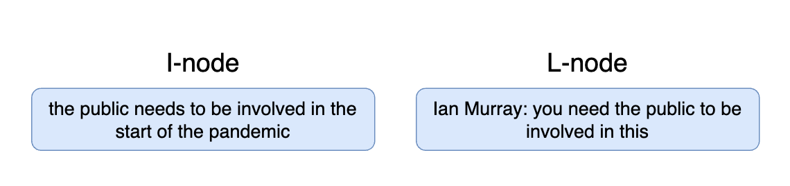

# ARG Tech AIF Datasets
The repository containing links, descriptions and references for the publicly datasets, models and shared tasks from ARG Tech group.
<br>

<b>Please, cite us if you are using our resources in your projects.</b>
# Who are we ? 
The Centre for Argument Technology (ARG Tech) works in philosophical and linguistic theory of argument, in computational models of argument and their implementation in artificial intelligence systems, and in deploying argument technology solutions to large audiences. Our research has attracted £10m in funding in areas as diverse as law, defence and media, and we have partnered with organisations including IBM, the BBC and the UN. We have over 200 papers in print, and our freely available software, including argument annotation tool, OVA, has tens of thousands of users around the world. We host the largest extant public datasets of annotated argument and debate at aifdb.org, and our work with public engagement and the media has reached over 30 million people.


# Table of Contents 
- [Available Datasets](#available-datasets)
- [Scripts and Tutorials](#scripts-and-tutorials)
- [Overview of our Shared Tasks](#overview-of-our-shared-tasks)
- [Overview of our Pre-Trained Models](#overview-of-our-pre-trained-models)
- [Scripts and Tutorials](#scripts-and-tutorials)
- [Argument Interchange Format (AIF)](#argument-interchange-format-aif)
- [Useful Links and Contacts](#useful-links-and-contacts)

# Available Datasets
All of our datasets follow the AIF format. You can see the explanation in [The Format Explanation Section](#argument-interchange-format-aif).


| Year | Dataset Name | Description | Download | Reference | Paper |
| --- | --- | --- |  --- | --- | --- |
|2022|QT30: A corpus of argument and conflict in broadcast debate| The corpus of analysed dialogical argumentation and broadcast political debate, using 30 episodes of BBC`s 'Question Time' from 2020 and 2021. Contains 19,842 utterances and 280,000 words.| [Link](https://corpora.aifdb.org/qt30) | [BibTeX](references/db732e60cc054949a08a9f37d8767690.bibtex) | [Link](https://discovery.dundee.ac.uk/en/publications/qt30-a-corpus-of-argument-and-conflict-in-broadcast-debate) |


# Overview of our Shared Tasks
| Task Name | Description |
 --- | --- |
|[DialAM-2024](http://dialam.arg.tech)|The first shared task in dialogue argument mining where argumentation and dialogue information is modelled together in a domain-independent framework. It consists of two sub-tasks: the identification of propositional (argumentative) relations, and the identification of illocutionary (speech act) relations.|

# Overview of our Pre-Trained Models

Our huggingface-hub organization can be found [here](https://huggingface.co/arg-tech).

| Model | Description | Paper Reference |
| --- | --- | --- |
|[ArgumentMining-EN-ARI-AIF-RoBERTa_L](https://huggingface.co/raruidol/ArgumentMining-EN-ARI-AIF-RoBERTa_L)|Argument Mining model trained with English (EN) data for the Argument Relation Identification (ARI) task using the US2016 and the QT30 corpora.|[BibTeX](references/ruiz2021transformer.bibtex)|


# Scripts and Tutorials

# Argument Interchange Format (AIF)

It is a brief overview, the more detailed explanations can be found [here](docs_add_info%2FIAT_guidelines_and_tutorials-2023-10.pdf) and in the following papers:
```text
Katarzyna Budzynska, Mathilde Janier, Chris Reed, and Patrick Saint Dizier. Theoretical foundations for illocutionary structure parsing. Argument & Computation, 7(1):91–108, 2016.

Mathilde Janier, Mark Snaith, Katarzyna Budzynska, John Lawrence, and Chris Reed. A sys- tem for dispute mediation: The mediation dialogue game. In The 6th International Conference on Computational Models of Argument, pages 351–358. IOS Press, 2016.
```

To understand the AIF format and why it used in argument mining and in this project, some basics of the Inference Anchoring Theory are required.

<br>

A text (conversation, discussion, article, etc.) in AIT is considered to be a set of separate spans that are called argumentative discourse units (ADUs).
ADUs are related between each other, creating a directed graph of the argument, which is encoded in the AIF. 
ADUs are like atoms in this theory: the smallest units to work with.

#### What is Argumentative Discourse Unit (ADU)

ADU is a text span which has a propositional content anchored (attached/grouped to) in either the locution (text phrase) itself or a
transition (connection) targeting this locution; and has discrete argumentative function,
in that the propositional content stands in
relation to one or more other propositions via one or more instances of inference, conflict or rephrase.

Less formally, lets look at the example:
```text

Bob: Please, be careful with the table.

Worker: Why ?  

Bob: It has a glass element, so it could brake.
```

The ADUs here are:
```python
[
 "Bob: Please, be careful with the table.",
 "Worker: Why ?",
 "Bob: It has a glass element,",
 "Bob: so it could brake."
]
```

Each of the text of ADU contains information of the speaker, as well as the information that may lead to some instance. 
For example, the sentence <i>'It has a glass elements, so it could brake.'</i> is split into 2 ADUs, as it contains 2 different spans that are connected:

<br>

'It has a glass element' -> 'so it could brake'. Note, that is not necessary a sentence, but rather a text chunk.

<br>

There are different possible relations that could be formed between ADUs. These relations are called 
<i>Discrete Argumentative Function</i>. The full list and their description can be found [here](docs_add_info%2FIAT_guidelines_and_tutorials-2023-10.pdf), Section 1.1.


#### Types of ADUs
For a content spans, ADUs are separated into two types: I-nodes (information nodes) and L-nodes (locution nodes). 
The best way to explain the difference is via the example (see image below).



The L-node has an unprocessed text ''as-is'' from the speaker, when the I-node has its processed version with the context 
and contains only required ''neutral'' semantics.
The reason for a separation like this is to make an analysis of the content easier and to minimize the effects of style, lack of context (e.g. prepositions), etc.
L-nodes and I-nodes have a one-to-one mapping between each other and represent an information of the argument with the help of a transition node. 
The example will be presented in the next section. Additionally, such separation is required in order to compare examine the style, 
the rhetoric component of the text etc. separately and with the connection to what was actually ment.


#### Transitions
A transition captures a response or a reply and embodies a functional relationship between predecessor locution and successor locution. 
Less formally, it is a directed edge between different ADUs in a graph, but with a twist: not only the edge is created, but an additional 
node in between.
The reason for this complex structure is that ADUs can have a relation not only to other ADUs, but to the connections itself. For example, 
ADU can attack the transition between two possible text spans, but not the content itself. Also, they could indicate grouping of different nodes and/or pairs of nodes
into one argument with the described structure.
Moreover, they can indicate the connection between I- and L-nodes, type of such connection and so on. Looks a bit complicated - but no worries, 
it will be easier with the image example. It comes soon! :)

<br>

Transition nodes are called <i>TA</i> nodes and may include Asserting, Questioning, Conflict and so on. Note that they do not necessary a 
binary relations: they could have multiple ancestors/children nodes.

<br>

For example, consider a TA between the L- and I-nodes in the image below.


The transition here is between L-node to I-node that indicate, that the speaker in the L-node asserted the statement that is reflected in 
the corresponding I-node.

#### Propositions and their relations
Propositions are the text chunks that consist of the contents of individual locutions. 
Proposition is always a sentence with a resolved pronouns.

<br>

Relations between propositional contents are about a speaker’s intended use of linguistic material. These relations occur 
only between the I-nodes (the ones that reflect the processed content only). 

<br>

We distinguish three types of propositional relations:
* Inference (RA nodes) (e.g. Inference, Support); 
* Conflict (CA nodes) (e.g. Attack)
* Rephrase (MA nodes) (e.g. Paraphrase)

These connections are inserted into the graph "in between" the edge. They indicate the relationships between the content 
pieces - how the argument is evolving, how people builds the argument, whether the previous I-node was attacked by another argument and so on.

#### Illocutionary Connections

The final piece of the puzzle are YA-nodes. YA-nodes are the nodes that are constructed "in between" the TA-nodes and propositional relations
(RA, CA, MA). They are used to bound (or anchor) together pairs of arguments/text chunks/content pieces in a specific relation. 
They give a clear indication on which content pieces are grouped into the same argument.

<br>

<b>Lets wrap everything we discussed so far!</b> On the image below an example of a part of a graph is presented.


Let's break it down bit by bit: 

1. The text is gathered from the speakers.
2. The text is split into L-nodes with the clear indication of the speaker and the content. 
3. I-nodes are retrieved from L-nodes: processing them by referencing the pronouns, 'neutralizing' the style, obtaining the semantics.
4. TA nodes are drawn indicating the flow of the argument (not time-manner, but connectivity of text pieces responding to other text pieces)
5. Propositional relationships are build (RA node on the example) creating the clear understanding of the specific type of the connection between the locutions.
6. YA-nodes are added to group together pairs (or maybe more) nodes into the argument.

In short, that is it! 

<br>

Now the AIF representation of this theoretical framework will be presented.

## xAIF Data Format

The xAIF format is a json file that has the following structure:

```python
empty_xaif_example = {
    "AIF": {
        "nodes": [],
        "edges": [],
        "locutions": [],
        "participants": []
    },
    "<ADDITIONAL_FIELD>": []
}
```

THe <i>AIF</i> key contains the argument graph (as was described before). For example, let's go back to the image
that was presented:


The AIF representation of this graph would include the following:

###### nodes

Each node of the graph (I-node, L-node, RA,CA,MA,TA,YA nodes) will be presented as dictionaries of the following format:
```python
{
    "nodeID": "<NODE ID>",
    "type": "<NODE TYPE, E.G. - I>",
    "text": "<NODE TEXT>",
    "timestamp": "OPTIONAL"
}
```

The keys are:

+ <i>nodeID</i>: str, usually an integer ("1", "2" etc.). Unique identifier of the node.
+ <i>type</i>: str, the node type: "L", "I", "CA", "TA", "YA", "RA", "MA".
+ <i>text</i>: str, text related to the node. For L-nodes usually follows a pattern of "<SPEAKER NAME>:<TEXT SPAN>"; 
for I-nodes "<PROCESSED TEXT SPAN>"; for other nodes its type of relations (e.g. "Default Transition", "Default Conflict", "Asserting" and so on).
+ <i>timestamp</i>: str, optional, might not be in every node. Timestamp of the node. Depending on the data, could be different. In this case, it is a time, when the text was said without accounting on the processing time.

For example:

```python
l_node_example = {
    "nodeID": "88",
    "text": "Sergiy Zhadan: I imagine it’s scary for birds to fly over the river",
    "type": "L",
    "timestamp": "2077-01-01 12:12:30"
}

i_node_example = {
    "nodeID": "12",
    "text": "Sergiy imagines that flying over the river is scary for birds",
    "type": "I",
    "timestamp": "2077-01-01 12:12:30"
}

ra_node_example = {
    "nodeID": "1",
    "text": "Inference",
    "type": "RA"
}
```
###### edges

Each edge is presented as a json: 

```python
edge_dict_example = {
    "edgeID": "<EDGE ID STR>",
    "fromID": "<nodID from nodes>",
    "toID": "<nodID from nodes>",
}
```

The keys are:

+ <i>edgeID</i>: str, usually an integer ("1", "2" etc.). Unique identifier of the edge.
+ <i>fromID</i>: str, nodeID that corresponds to one of the nodes in AIF["nodes"], FROM which the edge is going.
+ <i>toID</i>: str, nodeID that corresponds to one of the nodes in AIF["nodes"], TO which the edge is going.

For example:

```python
edge_example = {
    "fromID": "2",
    "toID": "10",
    "edgeID": "123443"
}
```

In the example, the edge json indicates that there is an edge from the node with id "2" to the node with id "10".
The info about these nodes can be found in AIF["nodes"], in the dictionaries with the corresponding "nodeID" value.

###### participants
Participant dict contains information about the speakers. The format is as follows:

```python
participant_example ={
    "participantID": "12",
    "firstname": "Sergiy",
    "surname": "Zhadan"
}
```

The keys are:

+ <i>participantID</i>: str, unique identifier of the person.
+ <i>firstname</i>: str, first name of the person if known. Otherwise "".
+ <i>surname</i>: str, last name of the person if known. Otherwise "".

###### locutions
The locutions are metadata about the speakers (mapping of unique speaker to the node content) of the nodes. The format is as follows:

```python
locution_example = {
      "nodeID": "1265674", 
      "personID": "0", 
      "timestamp": "2023-10-11 15:34:32"
    }
```

The keys are:

+ <i>nodeID</i>: str, nodeID that corresponds to one of the nodes in AIF["nodes"].
+ <i>personID</i>: str, unique speaker identifier that is mapped to the AIF["participants"].
+ <i>timestamp</i>: str, optional, might not be in every node. Timestamp of the node. Depending on the data, could be different. In this case, it is a time, when the text was said without accounting on the processing time.

# Useful Links and Contacts
[ LinkedIn]([https://www.linkedin.com/](https://www.linkedin.com/company/arg-tech/))
&nbsp;
[Our Website](https://www.arg.tech)
<br>

Email: contact@arg.tech

