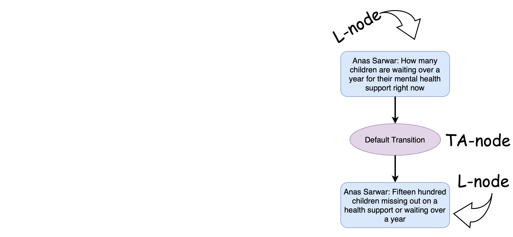

# ARG Tech AIF Datasets
The repository containing links, descriptions and references for the datasets and shared tasts from ARG Tech group.

# Who are we ? 
The Centre for Argument Technology (ARG Tech) works in philosophical and linguistic theory of argument, in computational models of argument and their implementation in artificial intelligence systems, and in deploying argument technology solutions to large audiences. Our research has attracted £10m in funding in areas as diverse as law, defence and media, and we have partnered with organisations including IBM, the BBC and the UN. We have over 200 papers in print, and our freely available software, including argument annotation tool, OVA, has tens of thousands of users around the world. We host the largest extant public datasets of annotated argument and debate at aifdb.org, and our work with public engagement and the media has reached over 30 million people.

# Table of Contents 
- [Available Datasets](#available-datasets)
- [Scripts and Tutorials](#scripts-and-tutorials)
- [Overview of our Shared Tasks](#overview-of-our-shared-tasks)
- [Overview of our Pre-Trained Models](#overview-of-our-pre-trained-models)
- [Scripts and Tutorials](#scripts-and-tutorials)
- [Argument Interchange Format (AIF)](#argument-interchange-format-aif)
- [Useful Links and Contacts](#useful-links-and-contacts)

# Available Datasets
All of our datasets follow the AIF format. You can see the explanation in [The Format Explanation Section](#argument-interchange-format-aif).

| Year | Dataset Name | Description | Donwload Link | Reference | Paper |
| --- | --- | --- |  --- | --- | --- |
|2022|QT30: A corpus of argument and conflict in broadcast debate| The corpus of analysed dialogical argumentation and broadcast political debate, using 30 episodes of BBC`s 'Question Time' from 2020 and 2021. Contains 19,842 utterances and 280,000 words.| [Link](https://corpora.aifdb.org/qt30) | [BibTeX](references/db732e60cc054949a08a9f37d8767690.bibtex) | [Paper Link](https://discovery.dundee.ac.uk/en/publications/qt30-a-corpus-of-argument-and-conflict-in-broadcast-debate) |

# Overview of our Shared Tasks
| Task Name | Description |
 --- | --- |
|[DialAM-2024](http://dialam.arg.tech)|The first shared task in dialogue argument mining where argumentation and dialogue information is modelled together in a domain-independent framework. It consists of two sub-tasks: the identification of propositional (argumentative) relations, and the identification of illocutionary (speech act) relations.|

# Overview of our Pre-Trained Models
| Model | Description | Paper Reference |
| --- | --- | --- |
|[ArgumentMining-EN-ARI-AIF-RoBERTa_L](https://huggingface.co/raruidol/ArgumentMining-EN-ARI-AIF-RoBERTa_L)|Argument Mining model trained with English (EN) data for the Argument Relation Identification (ARI) task using the US2016 and the QT30 corpora.|[BibTeX](references/ruiz2021transformer.bibtex)|

# Scripts and Tutorials

# Argument Interchange Format (AIF)

The AIF as a data format is constructed as a practical dataformat for Inference Anchoring Theory (IAT). The theory provides a theoretical toolkit to handle dialogue and argument structures, and the relations between them. We use IAT in order to represent and understand the arguments people offer, often on public platforms, in order to develop insight into complex debates.

  Simply speaking, AIF is a format for presenting text of a debate or an argument via the directed graph (see image below).

 
The base elements of the AIF are  argumentative discourse units (ADUs). ADUs can be further classified into L- and I-nodes. L-nodes (<b>locutions</b>) contain a unprocessed text with the information of the speaker included as well. I-nodes (<b>information</b>) contain a content of the ADUs. Keep in mind that the mapping of L and I nodes is not precise one to one.

 

Edges (incoming and outgoing) is the term used to describe the relations between the nodes.
IAT has three types of relations:

*  relations between locutions in a dialogue, called transitions (TAs);
*  relations between content (propositional content of locutions);
*  illocutionary connections that link locutions with their content.

These relations are collectively known as S-nodes (because they are governed by schemes) and they typically connect I-nodes.

Looks a bit complicated, isn`t it ?
  Well, lets break it down bit by bit.  
  From the beginning, we have L-nodes that are unformatted:
 

These two nodes correspond to a one speacker and have "Default Transition" relationship betwen them. THese relationship between ttwo L-nodes is described as <b>TA</b> node.
  After that, we retrieve the information from the L-nodes into I-nodes:

Note, that the arrows go into different direction now, as well as new relations appeared between I-nodes. There are different possible options for the relationships, such as <b>MA and CA</b> and others. We are not going here in a more details. These types of relationships are called <b>S-nodes</b>. In this case, the relation here is "Default Replhrase", which indicates paraphrasing of the statement. 
  Finally, additional endges are linked from the L-nodes to I-nodes, where applicable:

And we have a final picture. The final nodes are called <b>YA</b> nodes and they connect L- and I-nodes.

Need more details ? Check this out!

# Useful Links and Contacts
[ LinkedIn]([https://www.linkedin.com/](https://www.linkedin.com/company/arg-tech/))
&nbsp;
[ GitHub]([https://github.com/](https://github.com/arg-tech)https://github.com/arg-tech)
&nbsp;
[Our Website](https://www.arg.tech)
 

Email: contact@arg.tech

